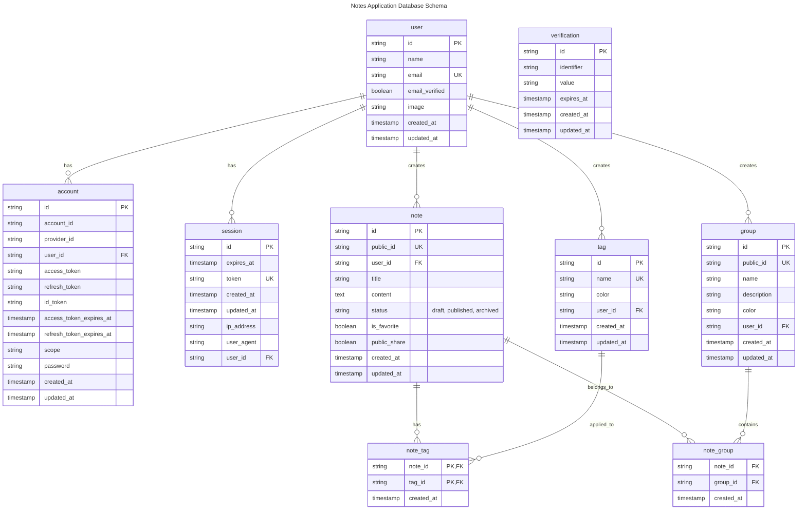

```mermaid
---
title: Notes Application Database Schema
---
erDiagram
    %% Authentication & User Management
    user {
        string id PK
        string name
        string email UK
        boolean email_verified
        string image
        timestamp created_at
        timestamp updated_at
    }

    account {
        string id PK
        string account_id
        string provider_id
        string user_id FK
        string access_token
        string refresh_token
        string id_token
        timestamp access_token_expires_at
        timestamp refresh_token_expires_at
        string scope
        string password
        timestamp created_at
        timestamp updated_at
    }

    session {
        string id PK
        timestamp expires_at
        string token UK
        timestamp created_at
        timestamp updated_at
        string ip_address
        string user_agent
        string user_id FK
    }

    verification {
        string id PK
        string identifier
        string value
        timestamp expires_at
        timestamp created_at
        timestamp updated_at
    }

    %% Notes & Content Management
    note {
        string id PK
        string public_id UK
        string user_id FK
        string title
        text content
        string status "draft, published, archived"
        boolean is_favorite
        boolean public_share
        timestamp created_at
        timestamp updated_at
    }

    group {
        string id PK
        string public_id UK
        string name
        string description
        string color
        string user_id FK
        timestamp created_at
        timestamp updated_at
    }

    tag {
        string id PK
        string name UK
        string color
        string user_id FK
        timestamp created_at
        timestamp updated_at
    }

    note_tag {
        string note_id PK,FK
        string tag_id PK,FK
        timestamp created_at
    }

    note_group {
        string note_id FK
        string group_id FK
        timestamp created_at
    }

    %% Relationships
    user ||--o{ account : "has"
    user ||--o{ session : "has"
    user ||--o{ note : "creates"
    user ||--o{ group : "creates"
    user ||--o{ tag : "creates"

    note ||--o{ note_tag : "has"
    note ||--o{ note_group : "belongs_to"

    tag ||--o{ note_tag : "applied_to"
    group ||--o{ note_group : "contains"
```
